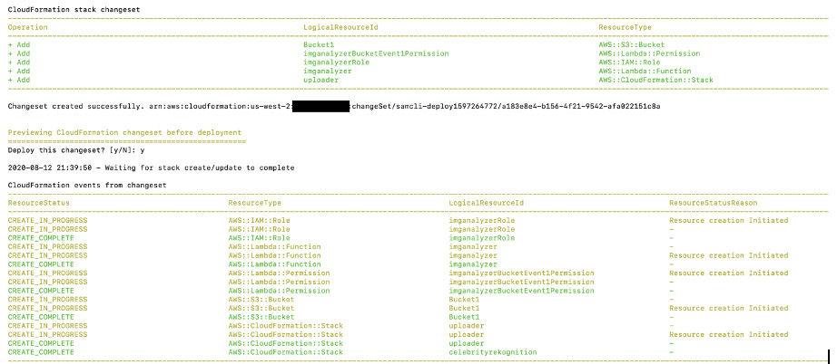

## Building and deploying a serverless app using AWS Serverless Application Repository (SAR) and AWS Serverless Application Model (SAM)

In this demo, you will build and deploy a celebrity image recognition application which is a combination two separate applications:

* An image recognition application, which you will implement using a Lambda function

* An uploader application which is already built and published in AWS SAR. It provides a key functionality required for our demo app which is to uploading an image to an s3 bucket. Instead of building this functionality into our demo app, you simply copy its configuration and nest it into the SAM template of the demo app to deploy it to your AWS account.

### Prerequisites

To implement this demo application, you will need the following:

- An [AWS account](https://aws.amazon.com/premiumsupport/knowledge-center/create-and-activate-aws-account/)
- The latest version of the [AWS Command Line Interface (AWS CLI)](https://docs.aws.amazon.com/cli/latest/userguide/cli-chap-install.html)
- The AWS [SAM CLI](https://docs.aws.amazon.com/serverless-application-model/latest/developerguide/serverless-sam-cli-install.html) (version 1.0.0 or later)
- The AWS CloudFormation linter (cfn-lint)

### Architecture diagram

The following diagram shows the architecture of the image recognition application we will build:

  

### Searching for the uploader appin AWS Serverless Application Repository

- In the AWS Serverless Application Repository, search for an uploader app and copy its configuration into an AWS SAM template. 
- Go to the AWS Lambda console and choose Create function. 
- Choose Browse serverless app repository and in the search field, enter upload to s3. 
- Choose the [uploader](https://serverlessrepo.aws.amazon.com/applications/arn:aws:serverlessrepo:us-east-1:233054207705:applications~uploader) application, as shown in the screenshot below:

  

### Deploying the application
Download the `code` directory to your local system and then run the following command to deploy the template:

	sam deploy --guided --capabilities CAPABILITY_IAM CAPABILITY_AUTO_EXPAND

Provide the arguments for the SAM deploy interactive menu, as shown here:

	Configuring SAM deploy
	======================

	Looking for samconfig.toml :  Not found

	Setting default arguments for 'sam deploy'
	=========================================
	Stack Name [sam-app]: celebrityrekognition 
	AWS Region [us-east-1]: us-east-2
	#Shows you resources changes to be deployed and require a 'Y' to initiate deploy
	Confirm changes before deploy [y/N]: y
	#SAM needs permission to be able to create roles to connect to the resources in your template
	Allow SAM CLI IAM role creation [Y/n]: Y
	Save arguments to samconfig.toml [Y/n]: Y

	Looking for resources needed for deployment: Not found.
	Creating the required resources...
	Successfully created!

You should see the following message:

### Testing the application

- Go to the [AWS Lambda console](https://console.aws.amazon.com/lambda/home?region=us-east-1), and from the left navigation pane, choose Applications. 

  

- Choose the link for the uploader app. Its description says Serverless web application for uploading files to S3.
- On the details page, choose the API endpoint URL. 
- Download [img/andy_portrait_thumb.jpg](https://github.com/aws-samples/amazon-rekognition-videoanalyzer-serverless-with-sam-and-sar/blob/master/img/andy_portrait_thumb.jpg) and [img/jeff_portrait_thumb.jpg](https://github.com/aws-samples/amazon-rekognition-videoanalyzer-serverless-with-sam-and-sar/blob/master/img/jeff_portrait_thumb.jpg) to your local system. Then drag and drop both images inside the orange circle displayed by the API gateway endpoint. 
- Go to the AWS Lambda console and choose your Lambda function
- From the Monitoring tab, choose View logs in CloudWatch and select the corresponding logstream to view the log results shown below:

  

Remember to clean up resources created from this demo in your AWS account!

## License

This library is licensed under the MIT-0 License. See the LICENSE file.

